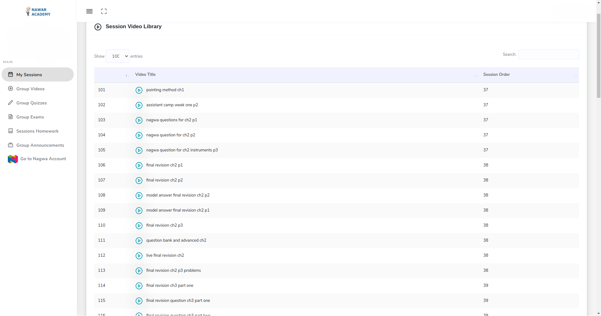

# _Spider Nawar_

** UPDATE **

__the code is not working anymore.__


-- **__alternate interface for nawaracademy.com__** --

watch nawar's lessons without opening the browser and wasting resources.

## Usage

```bash
# set the 'EMAIL' and 'PASS' enviroment variables
export EMAIL="emailusedforregisteration@abc.xyz"
export PASS="passusedforregisteraTion@123"

# Run the script
python ./stupidbot.py

# use -d flag to print cookies, payload, headers
python ./stupidbot.py -d

# use serve argument to serve http with flask (must be the first argument)
python ./stupidbot.py serve


# output (csv format)
# => 0,video title, http://[video_url]
# => ...

```

to activate the webserver change the RUN_SERVER variable from False to True.



that's a screenshot of the page that is used to extract information from.


old demo

data stored [here](./censored.csv).

> Do not use it

-- M1cR0xf7
